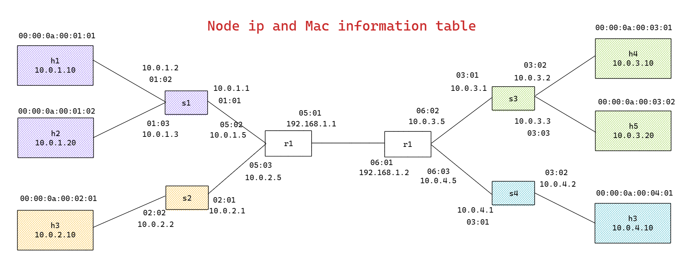
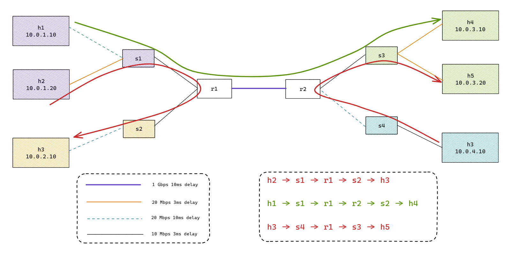

### Introduction ###

This demo shows how to implement a basic IP routers with static routing entries using P4, BMv2 and Mininet. 

The basic functionality of IP router is:

- determine the output port for packet based on destination IP (Longest Prefix Match)
- decrement TTL value for IP protocol
- update destination MAC address based on next-hop IP address
- update source MAC address according to output port

We have implemented the functionality of IP router as P4 program (router.p4). The program design is as follows:

- We have used V1Model of P4_16 composed of Ingress and Egress control pipelines
- For Ingress control pipeline there is one table defined:
  - **routing_table** - it determines the output port based on IPv4 LPM. When packet is matched the *ipv4_forward* action is invoked. It sets next-hop IP address in the routing_metadata, decrements IPv4 TTL and sets output port.
- For Egress control pipeline we have defined two tables:
  - **switching_table** - it is responsible for setting destination MAC based on next-hop IP address, which is retrieved from routing metadata.
  - **mac_rewriting_table** - it updates source MAC address according to the output port for the packet.

The router.p4 program defines the data plane of IP routers. Note that the control plane in this demo is realized by populating static rules.

The structure of the test network is shown below. Each network device has been configured with the **router.p4** program. 

<p align="center">
  
</p>

<p align="center">
  
</p>

The choice of this topology results from the following **paper[1]**

```
.
├── basic.p4                # for p4 switch
├── network.py              # Try with "sudo python3 FatTree.py" boost mininet with CLI 
├── r1-commands.txt         # commands file for router 1
├── r2-commands.txt         # commands file for router 2
├── Readme.md               # YOU ARE HERE!
├── router.p4               # for p4 router
├── s1-commands.txt         # commands file for switch &1.2.3.4
├── s2-commands.txt
├── s3-commands.txt
└── s4-commands.txt
```

### Demo ###

1. First of all you need to setup the environment on your Linux machine.
2. Enter the ip-routing/ directory.

`cd ip-routing/`

3. Run the Mininet topology.

`sudo python3 network.py`

4. In the Mininet console, check if ping between h1 and h2 works

`h1 ping h2`
or `h1 ping h6` etc.

5. Have a nice day!


## Reference

**[1]** Anagnostakis K G, Greenwald M B, Ryger R S. On the sensitivity of network simulation to topology[C]//Proceedings. 10th IEEE International Symposium on Modeling, Analysis and Simulation of Computer and Telecommunications Systems. IEEE, 2002: 117-126.